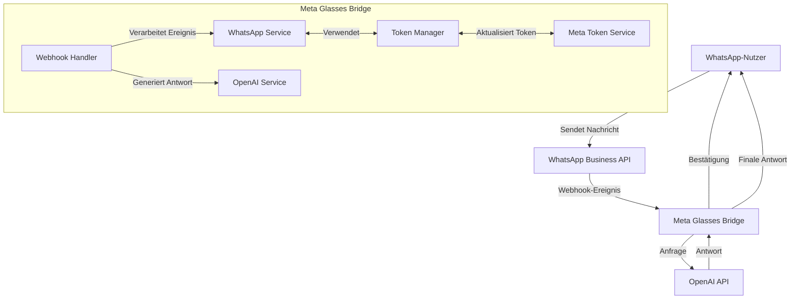
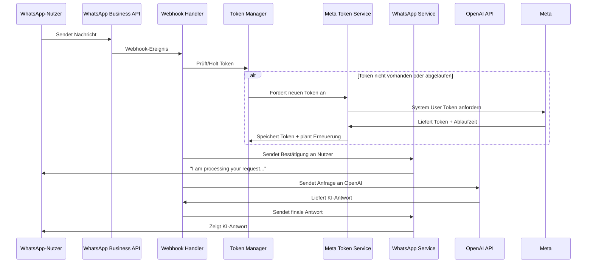
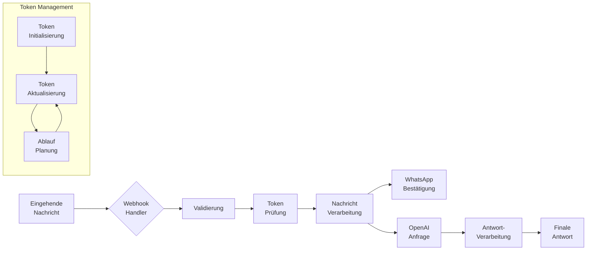
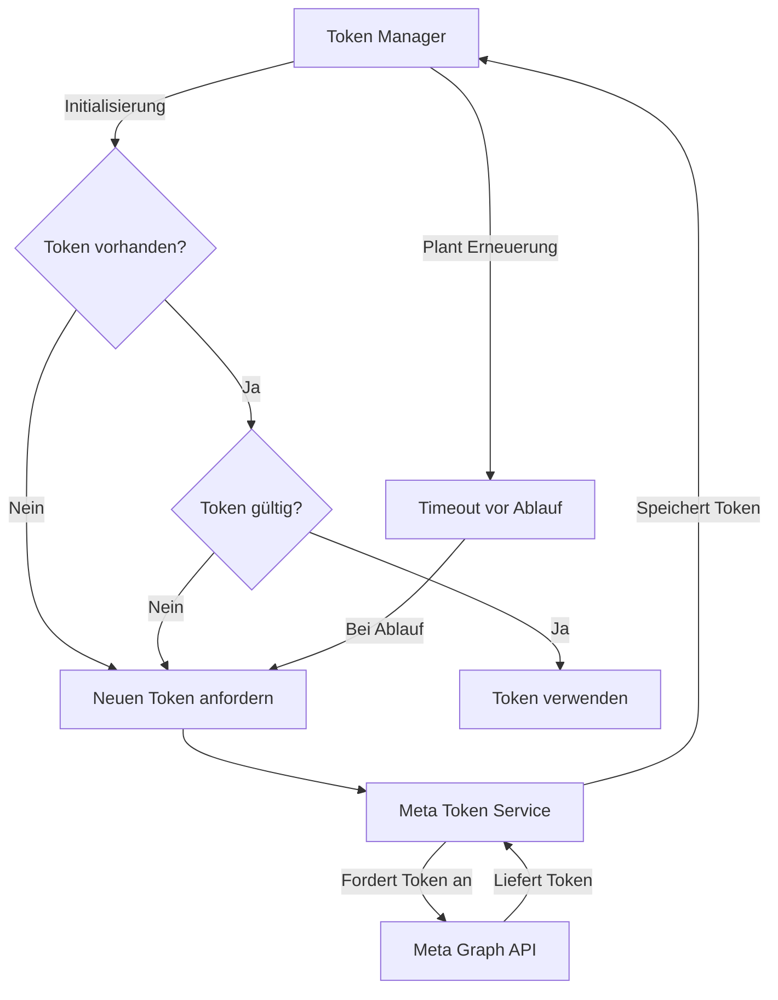

# Meta WhatsApp Bot

Ein WhatsApp Bot mit OpenAI Integration.

## Konfiguration

### Umgebungsvariablen

#### Meta WhatsApp Konfiguration
```env
# WhatsApp Business API
META_PHONE_NUMBER_ID=       # Ihre WhatsApp Business Phone Number ID
META_BUSINESS_ACCOUNT_ID=   # Ihre Business Account ID (optional)

# Meta Authentifizierung
META_ACCESS_TOKEN=          # WhatsApp API Access Token
META_APP_ID=               # Meta App ID (für Token-Erneuerung)
META_APP_SECRET=           # Meta App Secret (für Token-Erneuerung)

# Webhook
META_WEBHOOK_VERIFY_TOKEN=  # Selbst definierter Token für Webhook-Verifizierung
```

#### OpenAI Konfiguration
```env
OPENAI_API_KEY=            # OpenAI API Schlüssel
OPENAI_ORG_ID=            # OpenAI Organisations ID (optional)
```

### Token-Verwaltung

1. **Meta WhatsApp Tokens**
   - `META_ACCESS_TOKEN`: Haupttoken für WhatsApp API Zugriff
   - `META_WEBHOOK_VERIFY_TOKEN`: Sicherheitstoken für Webhook-Verifizierung
   - `META_APP_ID` & `META_APP_SECRET`: Für automatische Token-Erneuerung

2. **OpenAI Tokens**
   - `OPENAI_API_KEY`: Für OpenAI API Zugriff
   - `OPENAI_ORG_ID`: Optional für organisationsspezifische Einstellungen

### Konfigurationsdateien

Die Konfiguration ist in zwei Hauptdateien organisiert:

1. `src/config/meta.js`: WhatsApp/Meta Konfiguration
   - API-Einstellungen
   - Authentifizierung
   - Webhook-Konfiguration

2. `src/config/openai.js`: OpenAI Konfiguration
   - API-Schlüssel
   - Organisations-Einstellungen

## Entwicklung

### Installation

```bash
npm install
```

### Entwicklungsserver starten

```bash
npm run dev
```

### Deployment

```bash
vercel deploy --prod
```

## Best Practices

1. **Umgebungsvariablen**
   - Meta-bezogene Variablen mit `META_` Prefix
   - OpenAI-bezogene Variablen mit `OPENAI_` Prefix
   - Sensitive Daten immer in `.env` Dateien

2. **Konfigurationsvalidierung**
   - Automatische Validierung beim Start
   - Klare Fehlermeldungen bei fehlenden Variablen

3. **Logging**
   - Zentralisiertes Logging-System
   - Konfigurierbare Log-Level
   - Strukturierte Fehlerbehandlung

## Fehlerbehandlung

Bei Konfigurationsfehlern:
1. Überprüfen Sie die erforderlichen Umgebungsvariablen
2. Validieren Sie die Token-Gültigkeit
3. Prüfen Sie die Log-Ausgaben für detaillierte Fehlermeldungen

## Architektur-Übersicht



## Sequenzdiagramm



## Features

- **WhatsApp Integration**: Verbindung mit der WhatsApp Business API
- **OpenAI GPT-4 Integration**: Fortschrittliche KI-Verarbeitung von Textanfragen
- **Automatisches Token-Management**: Long-Lived Access Tokens mit automatischer Erneuerung
- **Robuste Fehlerbehandlung**: Wiederholungsversuche und ausführliches Logging
- **Skalierbare Architektur**: Serverless-Deployment auf Vercel

## Technischer Datenfluss



## Installation

1. Repository klonen:
```bash
git clone https://github.com/muraschal/meta.git
cd meta
```

2. Abhängigkeiten installieren:
```bash
npm install
```

3. Umgebungsvariablen konfigurieren:
```
META_APP_ID=deine_app_id
META_APP_SECRET=dein_app_secret
WEBHOOK_VERIFY_TOKEN=dein_verify_token
OPENAI_API_KEY=dein_openai_api_key
OPENAI_ORG_ID=deine_openai_org_id
```

## Konfiguration

Sie benötigen folgende Zugangsdaten:

1. **Meta Developer Account**:
   - Business App mit WhatsApp-Integration
   - App ID und App Secret

2. **OpenAI Account**:
   - API-Schlüssel
   - Organisations-ID

3. **Vercel Account** (für Deployment):
   - Verknüpftes GitHub-Repository

## Token Management



## Verwendung

1. Server lokal starten:
```bash
vercel dev
```

2. Server auf Vercel deployen:
```bash
vercel deploy --prod
```

3. WhatsApp Business Account einrichten:
   - Webhook konfigurieren: `https://deine-domain.com/api/webhook`
   - Verify Token eintragen (muss mit WEBHOOK_VERIFY_TOKEN übereinstimmen)

## API-Endpunkte

- Webhook: `https://deine-domain.com/api/webhook`
  - GET: Verifiziert den Webhook
  - POST: Empfängt Nachrichten von WhatsApp

## Entwicklung

- `vercel dev`: Startet den Entwicklungsserver lokal
- `vercel deploy --prod`: Deployt auf Vercel Production

## Logs

Die Logs sind mit Emojis formatiert für bessere Übersichtlichkeit:
- ℹ️ Informationen
- ✅ Erfolgsmeldungen
- ❌ Fehlermeldungen